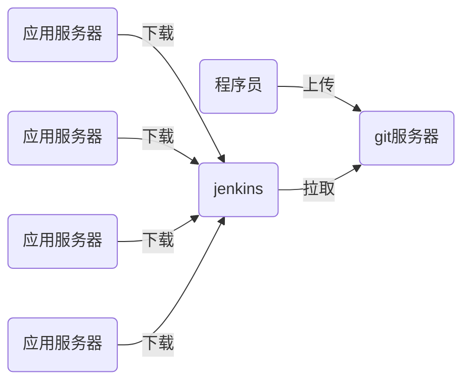

# DEVOPS

# DEVOPS DAY01

## 一、多进程编程

### （一）forking工作原理

#### 1、forking概念

• fork(分岔)在Linux系统中使用非常广泛
• 当某一命令执行时,父进程(当前进程)fork出一个子进程
• 父进程将自身资源拷贝一份,命令在子进程中运行时,就具有和父进程完全一样的运行环境

多进程

编写的程序，默认是单进程、单线程。程序只能按编写的序列一条条地扫行。

执行指令时，父进程自身拷贝一份，生成子进程，指令载子进程中运行，称作fork

在python中，os.fork()实现多进程

注意：windows中不支持多进程编程

#### 2、进程的声明周期

• 父进程fork出子进程并挂起
• 子进程运行完毕后,释放大部分资源并通知父进程,这个时候,子进程被称作僵尸进程
• 父进程获知子进程结束,子进程所有资源释放

#### 3、僵尸进程

• 僵尸进程没有任何可执行代码,也不能被调度
• 如果系统中存在过多的僵尸进程,将因为没有可用的进程号而导致系统不能产生新的进程
• 对于系统管理员来说,可以试图杀死其父进程或重启系统来消除僵尸进程

```python
import os
import time

ret_val = os.fork()
if ret_val:
    print('in parent')
    time.sleep(30)
    print('parent done')
else:
    print('in child')
    time.sleep(15)
    print('child done')

# watch -n1 ps a 观察进程状态
```

```python
import os
import subprocess
import time

def ping(host):

    result = subprocess.run(
        'ping -c2 %s &> /dev/null' % host, shell=True
    )

    if result.returncode == 0:
        print('%s:up' % host)
    else:
        print('%s:down' % host)

if __name__ == '__main__':
    ips = ['176.121.202.%s' % i for i in range(1, 255)]
    for ip in ips:
        ret_val = os.fork()
        if not ret_val:
            ping(ip)
            exit()
```


### （二）forking编程

#### 1、forking编程基本思路

• 需要使用os模块
• os.fork()函数实现forking功能
• python中,绝大多数的函数只返回一次,os.fork将返回两次
• 对fork()的调用,针对父进程返回子进程的PID;对于子进程,返回PID0

父进程只负责产生子进程

子进程服务负责工作

#### 2、解决zombie问题

• 父进程通过os.wait()来得到子进程是否终止的信息

• 在子进程终止和父进程调用wait()之间的这段时间,子进程被称为zombie(僵尸)进程
• 如果子进程还没有终止,父进程先退出了,那么子进程会持续工作。系统自动将子进程的父进程设置为init进程,init将来负责清理僵尸进程

• python可以使用waitpid()来处理子进程
• waitpid()接受两个参数,第一个参数设置为-1,表示与wait()函数相同;第二参数如果设置为0表示挂起父进程,直到子程序退出,设置为1表示不挂起父进程
• waitpid()的返回值:如果子进程尚未结束则返回0,否则返回子进程的PID

```python
import os
import time

ret_val = os.fork()

if ret_val:
    print('父进程')
    result = os.waitpid(-1, 0)
    print(result)
    time.sleep(5)
else:
    print('子进程')
    time.sleep(20)
    print('child done')
```


## 二、多线程编程

（一）多线程工作原理

1、多线程的动机

• 在多线程(MT)编程出现之前,电脑程序的运行由一个执行序列组成,执行序列按顺序在主机的中央处理器(CPU)中运行
• 无论是任务本身要求顺序执行还是整个程序是由多个子任务组成,程序都是按这种方式执行的
• 即使子任务相互独立,互相无关(即,一个子任务的结果不影响其它子任务的结果)时也是这样
• 如果并行运行这些相互独立的子任务可以大幅度地提升整个任务的效率

2、多线程任务的工作特点

• 它们本质上就是异步的,需要有多个并发事务
• 各个事务的运行顺序可以是不确定的,随机的,不可预测的
• 这样的编程任务可以被分成多个执行流,每个流都有一个要完成的目标
• 根据应用的不同,这些子任务可能都要计算出一个中间结果,用于合并得到最后的结果

3、进程概念

• 计算机程序只不过是磁盘中可执行的、二进制(或其
它类型)的数据
• 进程(有时被称为重量级进程)是程序的一次执行
• 每个进程都有自己的地址空间、内存以及其它记录其运行轨迹的辅助数据
• 操作系统管理在其上运行的所有进程,并为这些进程公平地分配时间

4、线程概念

• 线程(有时被称为轻量级进程)跟进程有些相似。不同的是,所有的线程运行在同一个进程中,共享相同的运行环境
• 一个进程中的各个线程之间共享同一片数据空间,所以线程之间可以比进程之间更方便地共享数据以及相互通讯

### （二）多线程编程

#### 1、多线程相关模块

• thread和threading模块允许程序员创建和管理线程
• thread模块提供了基本的线程和锁的支持,而threading提供了更高级别、功能更强的线程管理功能
• 推荐使用更高级别的threading模块

#### 2、传递函数给Thread类

• 多线程编程有多种方法,传递函数给threading模块的Thread类是介绍的第一种方法
• Thread对象使用start()方法开始线程的执行,使用join()方法挂起程序,直到线程结束

#### 3、传递可调用类给Thread类

• 传递可调用类给Thread类是介绍的第二种方法
• 相对于一个或几个函数来说,由于类对象里可以使用类的强大的功能,可以保存更多的信息,这种方法更为灵活

```python
import threading
import subprocess

def ping(host):
    result = subprocess.run(
        'ping -c2 %s &> /dev/null' % host, shell=True
    )

    if result.returncode == 0:
        print('%s:up' % host)
    else:
        print('%s:down' % host)


if __name__ == '__main__':
    ips = ['176.121.202.%s' % i for i in range(1, 255)]
    for ip in ips:
        t = threading.Thread(target=ping, args=(ip, )) # 创建线程
        t.start()  # 启动线程，target(*args)
```

```python
import threading
import subprocess

class Ping:
    def __call__(self, host):

        result = subprocess.run(
            'ping -c2 %s &> /dev/null' % host, shell = True
        )

        if result.returncode == 0:
            print('%s:up' % host)
        else:
            print('%s:down' % host)

if __name__ == '__main__':
    ips = ['176.121.202.%s' % i for i in range(1, 255)]
    for ip in ips:
        t = threading.Thread(target=Ping(), args=(ip, ))
        t.start()
```

```python
import threading
import subprocess

class Ping:
    def __init__(self, host):
        self.host = host

    def __call__(self):

        result = subprocess.run(
            'ping -c2 %s &> /dev/null' % self.host, shell = True
        )

        if result.returncode == 0:
            print('%s:up' % self.host)
        else:
            print('%s:down' % self.host)

if __name__ == '__main__':
    ips = ['176.121.202.%s' % i for i in range(1, 255)]

    for ip in ips:
        t = threading.Thread(target=Ping(ip))
        t.start()
```


## 三、urllib模块

### （一）urllib基础

#### 1、urllib简搜索路径的区域是固定的，必须将模块放到指定区域才能导入

• 在Python2版本中,有urllib和urlib2两个库可以用来实现request的发送。而在Python3中,已经不存在
urllib2这个库了,统一为urllib

常用于http/ftp客户端编程

• urllib中包括了四个模块
– urllib.request可以用来发送request和获取request的结果
– urllib.error包含了urllib.request产生的异常
– urllib.parse用来解析和处理URL
– urllib.robotparse用来解析页面的robots.txt文件

```python
>>> from urllib import request
>>> html  = request.urlopen('http://www.163.com')
>>> html.read(10)
b' <!DOCTYPE'
>>> html.readline()
b' HTML>\n'
>>> html.readlines()
```


#### 2、爬取网页

• 先需要导入用到的模块:urllib.request
• 在导入了模块之后,我们需要使用urllib.request.urlopen打开并爬取一个网页
• 读取内容常见的有3种方式:
– read()读取文件的全部内容,与readlines()不同的是,read()会把读取到的内容赋给一个字符串变量。
– readlines()读取文件的全部内容,readlines()会把读取到的内容赋值给一个列表变量。
– readline()读取文件的一行内容。

#### 3、下载网络资源

• urllib不仅可以下载网页,其他网络资源均可下载
• 有些文件比较大,需要像读取文件一样,每次读取一部分数据

```python
from urllib import request
import sys

def download(html, fname):
    url = request.urlopen(html)
    with open(fname, 'wb') as fobj:
        while 1:
            data = url.read(4096)
            if not data:
                break
            fobj.write(data)

if __name__ == '__main__':
    download(sys.argv[1], sys.argv[2])
```


#### 4、模拟客户端

• 有些网页为了防止别人恶意采集其信息所以进行了一些反爬虫的设置,而我们又想进行爬取
• 可以设置一些Headers信息(User-Agent),模拟成浏览器去访问这些网站

```python
>>> from urllib import request
>>> url = 'http://www.jianshu.com'
>>> request.urlopen(url)
...
urllib.error.HTTPError: HTTP Error 403: Forbidden
# 设定请求头的User-Agent为Firefox
>>> headers = {"User-Agent": "Mozilla/5.0 (X11; Linux x86_64; rv:72.0) Gecko/20100101 Firefox/72.0"}
# 构建一个请求对象
>>> r = request.Request(url, headers = headers)
>>> html = request.urlopen(r)
>>> html.read() # OK

```

#### 5、案例3:爬取图片

1. 将http://www.tedu.cn所有的图片下载到本地

2. 本地的目录为/tmp/images

3. 图片名与网站上图片名保持一致

   ```python
   import wget
   import os
   import re
   def get_patt(fname, patt, charset='utf8'):
       '用于在文件中找到相关的模式'
       result = []
       cpatt = re.compile(patt)
       with open(fname, encoding=charset) as fobj:
           for line in fobj:
               m = cpatt.search(line)
               if m:
                   result.append(m.group())
   
       return result
   
   if __name__ == '__main__':
       url = 'http://www.163.com'
       down_dir = '/tmp/163'
       fname = '/tmp/163/163.html'
       img_patt = '(http|https)://[\w./-]+.(jpg|jpeg|png|gif)'
   
   
       #下载目录不存在则创建
       if not os.path.exists(down_dir):
           os.mkdir(down_dir)
       if not os.path.exists(fname):
           wget.download(url, fname)
   
       img_list = get_patt(fname, img_patt, 'gbk')  # 取得图片url列表
   
       for img_url in img_list:
           wget.download(img_url, down_dir)
   ```

   

### （二）urllib进阶

#### 1、数据编码

• 一般来说,URL标准中只会允许一部分ASCII字符,比如数字、字母、部分符号等
• 而其他的一些字符,比如汉字等,>是不符合URL标准的。此时,我们需要编码。
• 如果要进行编码,可以使用urllib.request.quote()进行

```python
>>> url = 'https://www.sogou.com/web?query=春节'
>>> html = request.urlopen(url)
... ...
UnicodeEncodeError: 'ascii' codec can't encode characters in position 15-16: ordinal not in range(128)
>>> request.quote('春节')
'%E6%98%A5%E8%8A%82'
>>> url = 'https://www.sogou.com/web?query=' + request.quote('春节')
>>> url
'https://www.sogou.com/web?query=%E6%98%A5%E8%8A%82'
>>> html = request.urlopen(url)

```


#### 2、Wget模块

底层采用urll，实现下载功能

```python
(nsd1908) [root@room8pc16 day01]# pip install wget
>>> import wget
>>>
wget.download('https://img01.sogoucdn.com/app/a/100520021/3d14b6bc9f25f642eb896d30a3d8e413'
, '/tmp/aa.jpg')
```


#### 3、http异常处理

• 如果访问的页面不存在或拒绝访问,程序将抛出异常
• 捕获异常需要导入urllib.error模块

```python
>>>	html	=	urllib.request.urlopen('http://172.40.50.116/a.html')
urllib.error.HTTPError:	HTTP	Error	404:	Not	Found
>>>	html	=	urllib.request.urlopen('http://172.40.50.116/aaa')
urllib.error.HTTPError:	HTTP	Error	403:	Forbidden
```

#### 4、案例4:处理下载错误

1. 起动一个web服务

2. 在web服务器的文档目录下创建目录ban,权限设置为700

3. 编写python程序访问不存在的路径和ban目录,处理404和403错误

4. 404错误打印“无此页面”,403错误打印“无权访问”

  

## 四、paramiko模块

### （一）paramiko

#### 1、安装paramiko模块

• 本地安装

```shell
#	yum install	 -y	 gcc gcc-c++ python-devel
#	tar	-xzf paramiko-1.15.4.tar.gz
#	python setup.py install
```


• 网络安装

```shell
#	pip install paramiko
```


#### 2、基础使用介绍

• SSHClient
– 创建用于连接ssh服务器的实例

```python
>>>	 ssh = paramiko.SSHClient()
```

• paramiko.AutoAddPolicy
– 设置自动添加主机密钥
• ssh.connect
– 连接ssh服务器
• ssh.exec_comand
– 在ssh服务器上执行指定命令

#### 3、paramiko实例

• 编写用于实现ssh访问的脚本
– 创建SSHClient实例
– 设置添加主机密钥策略
– 连接ssh服务器
– 执行指定命令
– 在shell命令行中接受用于连接远程服务器的密码以及在远程主机上执行的命令

```python
>>> import paramiko
>>> ssh = paramiko.SSHClient() # 创建sshclient客户端
# 自动接受服务器发来的整数
>>> ssh.set_missing_host_key_policy(paramiko.AutoAddPolicy())
# 登陆
>>> ssh.connect('192.168.1.10', username='root', password='a')
# 执行命令后，返回值是由3个类文件对象构成的元组：（输入， 输出， 错误）
>>> result = ssh.exec_command('id root; id zhangsan')
>>> len(result)
3
# 也可以把执行后的返回数据分别赋值
>>> stdin, stdout, stderr = ssh.exec_command('id root; id zhangsan')
>>> out = stdout.read()
>>> stdin, stdout, stderr = ssh.exec_command('id root; id zhangsan')
>>> out = stdout
>>> stdin, stdout, stderr = ssh.exec_command('id root; id zhangsan')
>>> out = stdout.read()
>>> out
b'uid=0(root) gid=0(root) groups=0(root)\n'
>>> err = stderr.read()
>>> err
b'id: zhangsan: no such user\n'
```


#### 4、案例5:多线程ssh并发访问

• 编写脚本程序
1. 在文件中取出所有远程主机IP地址

2. 在shell命令行中接受远程服务器IP地址文件、远程服务器密码以及在远程主机上执行的命令

3. 通过多线程实现在所有的远程服务器上并发执行命令

   ```python
   import paramiko
   import sys
   import getpass
   import os
   import threading
   
   def rcmd(host, user, passwd, command):
       ssh = paramiko.SSHClient()
       ssh.set_missing_host_key_policy(paramiko.AutoAddPolicy())
       ssh.connect(host, username=user, password=passwd)
       stdin, stdout, stderr = ssh.exec_command(command)
       out = stdout.read()
       err = stderr.read()
       if out:
           print('\033[32;1m[%s] OUT:\n%s\033[0m' % (host, out.decode()))
       if err:
           print('\033[31;1m[%s] ERR:\n%s\033[0m' % (host, err.decode()))
   
       ssh.close()
   
   if __name__ == '__main__':
       #rcmd('192.168.1.10', 'root', 'a', 'id root; id zhangsan')
       if len(sys.argv) != 3:
           print("Usage:%s ipfile 'commands'"% sys.argv[0])
           exit(1)
       if not os.path.exists(sys.argv[1]):
           print('%s is not exists!' % sys.argv[1])
           exit(2)
       ipflie = sys.argv[1]
       cmds = sys.argv[2]
       passwd = getpass.getpass()
       with open(ipflie, 'rb') as fobj:
           for line in fobj:
               ip = line.strip()
               #rcmd(ip, 'root', passwd, cmds)
               t = threading.Thread(target=rcmd, args=(ip, 'root', passwd, cmds))
   ```

   

# DEVOPS DAY02

## 一、邮件和JSON

### （一）邮件编程

准备邮件，使用email模块

发送邮件，使用SMTP模块

#### 1、SMTP概述

• SMTP(Simple Mail Transfer Protocol)即简单邮件传输协议,使用TCP协议25端口

• 它是一组用于由源地址到目的地址传送邮件的规则,由它来控制信件的中转方式
• python的smtplib提供了一种很方便的途径发送电子邮件。它对smtp协议进行了简单的封装

#### 2、SMTP对象

• Python发送邮件,第一步是创建SMTP对象

```python
import smtplib
smtp_obj = smtplib.SMTP( [host	[, port	[, local_hostname]]] )
```

• 创建SMTP对象也可以不给定参数,之后再通过对象的其他方法进行绑定

#### 3、设置邮件

• 标准邮件需要三个头部信息
– From:发件人
– To:收件人
– Subject:主题

```python
from email.mime.text import	MIMEText
from email.header import Header
message	= MIMEText('Python	邮件发送测试...',	'plain',	'utf-8')
message[‘From’]	= Header("zzg",	'utf-8')	 #	发送者
message['To'] =	 Header("root",	'utf-8')	 #	接收者
subject	= 'Python	SMTP 邮件测试'
message['Subject']	= Header(subject, 'utf-8')
```


#### 4、sendmail方法

• Python SMTP 对象使用 sendmail 方法发送邮件

• sendmail方法三个必须的参数有:
– 收件人
– 发件人
– 消息主体msg是一个字符串,表示邮件

将准备好的邮件发送

#### 5、案例1:通过本机发送邮件

1. 创建bob和alice帐户
2. 编写发送邮件件程序,发件人为root,收件人是本机的bob和alice帐户

```python
from email.mime.text import MIMEText
from email.header import Header
import smtplib

# 准备邮件正文，plain表示纯文本，富文本可以指定不同的格式
msg = MIMEText('This is a python email test.\n', 'plain', 'utf8')
# 配置邮件头部消息
msg['From'] = Header('root', 'utf8')
msg['To'] = Header('tom', 'utf8')
msg['Subject'] = Header('py test', 'utf8')

#发送邮件
smtp = smtplib.SMTP('127.0.0.1')
smtp.sendmail('root', ['tom', 'root'], msg.as_bytes())
```


#### 5、SMTP认证

• 如果本机没有SMTP功能,也可以使用第三方的邮件服务器
• 第三方邮件服务器往往需要认证

```python
mail_host="mail.tedu.cn"	
mail_user="zzg"
mail_pass="zzg_pass"
smtp_obj =	smtplib.SMTP()
smtp_obj.connect(mail_host,	25)				# 25 为 SMTP	端口号
smtp.starttls()			#	如果使用证书,打开此注释
smtp_obj.login(mail_user,mail_pass)
smtp_obj.sendmail(sender,	receivers,	message.as_string())
```


#### 6、案例2:通过互联网服务器发送邮件

1. 通过自己互联网注册的邮箱,为其他同学互联网邮箱发邮件

  ```python
  from email.mime.text import MIMEText
  from email.header import Header
  import smtplib
  import getpass
  
  def send_mail(text, sender, recievers, subject, server, passwd):
      msg = MIMEText(text, 'plain', 'utf8')
  
      msg['From'] = Header(sender, 'utf8')
      msg['To'] = Header(recievers[0], 'utf8')
      msg['Subject'] = Header(subject, 'utf8')
  
      smtp = smtplib.SMTP()
      smtp.connect(server)
      smtp.login(sender, passwd)
      # smtp.starttls() # 如果DEVOPS DAY02服务器要求安全连接，打开此注释
      smtp.sendmail(sender, recievers, msg.as_bytes())
  
  if __name__ == '__main__':
      text = 'python 发来邮件'
      sender = '67916626@qq.com'
      recievers = ['67916626@qq.com', 'jianhuiye12@163.com', ]
      subject = 'python'
      server = 'smtp.qq.com'
      passwd = getpass.getpass() #填写授权码，不是登陆密码
      send_mail(text, sender,recievers, subject, server, passwd)
  ```

  

### （二）JSON

#### 1、JSON概述

• JSON(JavaScript Object Notation) 是一种轻量级的数据交换格式
• 易于人阅读和编写,同时也易于机器解析和生成
• 基于JavaScript Programming Language
• JSON采用完全独立于语言的文本格式,但是也使用了类似于C语言家族的习惯(包括C, C++, C#, Java,JavaScript, Perl, Python等)
• 这些特性使JSON成为理想的数据交换语言


#### 2、JSON结构

• JSON主要有两种结构
– “键/值”对的集合:python中主要对应成字典
– 值的有序列表:在大部分语言中,它被理解为数组

| Python      | JSON   |
| ----------- | ------ |
| dict        | object |
| list, tuple | array  |
| str         | string |
| int, float  | number |
| True        | true   |
| False       | false  |
| None        | null   |


#### 3、dumps方法

• 对编码后的json对象进行decode解码,得到原始数据,需要使用的json.loads()函数

```python
>>>	import json
>>>	number = json.dumps(100)
>>>	json.loads(number)
100
```


#### 4、loads方法

• 使用简单的json.dumps方法对简单数据类型进行编码

```python
>>>	import	json
>>>	json.dumps(100)
'100'
>>>	json.dumps([1,	2,	3])
'[1,	2,	3]'
>>>	json.dumps({'name':	'zzg'})
'{"name": "zzg"}'

# 将字典转成json字符串
>>> import json
>>> adict = {'name': 'tom', 'age':20} 
>>> json.dumps(adict)
'{"name": "tom", "age": 20}'
>>> data = json.dumps(adict)
>>> type(data)
<class 'str'>

# 将json字符串转成python的数据类型
>>> json.loads(data)
{'name': 'tom', 'age': 20}
>>> jdata = json.loads(data)
>>> type(jdata)
<class 'dict'>
```


#### 5、天气预报查询

• 搜索“中国天气网 城市代码查询”,查找城市代码
• 城市天气情况接口
– 实况天气获取:http://www.weather.com.cn/data/sk/城市代码.html
– 城市信息获取:
http://www.weather.com.cn/data/cityinfo/城市代码.html
– 详细指数获取:http://www.weather.com.cn/data/zs/城市代码.html

#### 6、案例3:天气预报查询

1. 运行程序时,屏幕将出现你所在城市各区县名字

2. 用户指定查询某区县,屏幕上将出现该区县当前的气温、湿度、风向、风速等

  ```python
安装
(nsd1908) [root@room8pc16 day02]# pip install /var/ftp/pub/zzg_pypkgs/requests_pkgs/*
# 获取文本内容>>> import requests
>>> r = requests.get('http://www.163.com')
>>> r.text
# 获取非文本内容(bytes类型)
>>> r = requests.get('https://i01picsos.sogoucdn.com/9fe8e2323d7f76a4')
>>> r.content
>>> with open('/tmp/abc.jpg', 'wb') as fobj:
...
fobj.write(r.content)
(nsd1908) [root@room8pc16 day02]# eog /tmp/abc.jpg
# 获取json内容
# 实况天气获取:http://www.weather.com.cn/data/sk/城市代码.html
# 城市信息获取:http://www.weather.com.cn/data/cityinfo/城市代码.html
# 详细指数获取:http://www.weather.com.cn/data/zs/城市代码.html
>>> url = 'http://www.weather.com.cn/data/sk/101010100.html'
>>> r = requests.get(url)
>>> r.json()
# 乱码
>>> r.encoding
# 查看字符编码
'ISO-8859-1'
>>> r.encoding = 'utf8'
# 修改字符编码
>>> r.json()
{'weatherinfo': {'city': '北京', 'cityid': '101010100', 'temp': '27.9',WD': '南风', 'WS': '小
于3级', 'SD': '28%', 'AP': '1002hPa', 'njd': '暂无WSE': '<3', 'time': '17:55', 'sm': '2.1',
'isRadar': '1', 'Radar': 'JC_RADAR_AZ9010_JB'}}
  ```

  

## 三、requests模块

### （一）requests基础

#### 1、requests简介

• Requests是用Python语言编写的、优雅而简单的HTTP库
• Requests内部采用来urillib3
• Requests使用起来肯定会比urillib3更简单便捷
• Requests需要单独安装

requ模块将每个httpd的方法都定义成了相关的函数

#### 2、requests特性

• 支持keep-alive的连接池
• 支持通用的域名以及URL地址
• 支持使用cookie
• 支持使用类似浏览器的SSL验证
• 文件上传、下载

#### 3、http的方法：GET和POST

• 通过requests发送一个GET请求,需要在URL里请求的参数可通过params传递

GET：在浏览器中输入网址、点击超链接、一部分表单（如搜索）

```python
r = requests.get(url="", params={},	headers={},	cookies={})
```

• 与GET不同的是,POST请求新增了一个可选参数data,需要通过POST请求传递的body里的数据可以通过data传递

POST：常用载表单提交数据（如注册、登陆）

```python
r =	requests.post(url="", ata ={}, params={}, file={}, headers={}, 
cookies={})
```


#### 4、http的其他方法

• 其他 HTTP 请求类型:PUT,DELETE,HEAD 以及OPTIONS使用起来一样简单

```python
>>>	r =	requests.put('http://httpbin.org/put', data	= {'key':'value'})
>>>	r =	requests.delete('http://httpbin.org/delete')
>>>	r =	requests.head('http://httpbin.org/get')
>>>	r =	requests.options('http://httpbin.org/get')
```


#### 5、请求参数

• 当访问一个URL时,我们经常需要发送一些查询的字段作为过滤信息,例如:httpbin.com/get?key=val,这里的key=val就是限定返回条件的参数键值对
• 当利用python的requests去发送一个需要包含这些参数键值对时,可以将它们传给params

```python
payload	= {'key1':'value1',	'key2':'value2'}
r =	requests.get('http://httpbin.com/get,	params =	payload)
```


#### 6、设定头部

• 用户也可以自己设定请求头

```python
url = 'https://api.github.com/some/endpoint'	
headers	= {'Accept': 'application/json'}
r =	requests.get(url, headers =	headers)
```


#### 7、发送请求数据

• 有时候,用户需要将一些数据放在请求的body内;这时候,就需要对data传参了(仅POST, DELETE,PUT等方法有该参数,GET没有,因为GET请求没有body)

```python
payload	= {'key1' :	'value1', 'key2' : 'value2'}
r =	requests.post('http://httpbin.org/post', data =	payload)
```


#### 8、课上案例

```python
# 安装
(nsd1908) [root@room8pc16 day02]# pip install /var/ftp/pub/zzg_pypkgs/requests_pkgs/*

# 获取文本内容
>>> import requests
>>> r = requests.get('http://www.163.com')
>>> r.text

# 获取非文本内容(bytes类型）
>>> r = requests.get('https://i01picsos.sogoucdn.com/9fe8e2323d7f76a4')
>>> r.content
>>> with open('/tmp/abc.jpg', 'wb') as fobj:
...   fobj.write(r.content)
(nsd1908) [root@room8pc16 day02]# eog /tmp/abc.jpg 

# 获取json内容
# 实况天气获取:http://www.weather.com.cn/data/sk/城市代码.html
# 城市信息获取:http://www.weather.com.cn/data/cityinfo/城市代码.html
# 详细指数获取:http://www.weather.com.cn/data/zs/城市代码.html
>>> url = 'http://www.weather.com.cn/data/sk/101010100.html'
>>> r = requests.get(url)
>>> r.json()  # 乱码
>>> r.encoding  # 查看字符编码
'ISO-8859-1'
>>> r.encoding = 'utf8'  # 修改字符编码
>>> r.json()
{'weatherinfo': {'city': '北京', 'cityid': '101010100', 'temp': '27.9',WD': '南风', 'WS': '小于3级', 'SD': '28%', 'AP': '1002hPa', 'njd': '暂无WSE': '<3', 'time': '17:55', 'sm': '2.1', 'isRadar': '1', 'Radar': 'JC_RADAR_AZ9010_JB'}}
```


### （二）requests基础

#### 1、响应内容

• 读取服务器响应的内容

```python
>>>	r =	requests.get('http://www.baidu.com')
>>>	r.text
```

• 请求发出后,Requests 会基于 HTTP 头部对响应的编码作出有根据的推测
• 可以找出 Requests 使用了什么编码,并且能够使用r.encoding 属性来改变它

```python
>>>	r.encoding
'ISO-8859-1'
>>>	r.encoding='utf8'
>>>	r.text
```

```python
>>> r = requests.get('http://www.jianshu.com')
>>> r.text  # 内容有<title>403 Forbidden</title>

# 修改头部的User-Agent为Firefox
>>> headers = {'User-Agent': 'Mozilla/5.0 (X11; Linux x86_64; rv:52.0) Gecko/20100101 Firefox/52.0'}
>>> r = requests.get('http://www.jianshu.com', headers=headers)
>>> r.text   # 正常内容
```


#### 2、其他相应内容格式

• 也可以用字节的方式访问请求响应体,尤其是非文本请求(如图片)

```python
>>>	r.content
```

• Requests 中还有一个内置的 JSON 解码器,助你处理 JSON 数据

```python
>>>	r.json()
```


#### 3、响应头

• 可以查看以字典形式展示的服务器响应头

```python
>>>	r.headers
{
'content-encoding':	'gzip',
'transfer-encoding':	'chunked',
'connection':	'close',
'server':	'nginx/1.0.4',
'x-runtime':	'148ms',
'etag':	'"e1ca502697e5c9317743dc078f67693f"',
'content-type':	'application/json'
}
```


#### 4、传参 

```python
# 查快递
>>> url = 'http://www.kuaidi100.com/query'
# type是快递公司名称，postid是单号
>>> params = {'type': 'shentong', 'postid': '773022616159695'}
>>> r = requests.get(url, params=params)
>>> r.json()
```


#### 5、案例4:钉钉机器人

1. 创建一个群聊钉钉机器人

2. 编写代码,通过python脚本实现钉钉机器人在群中发送消息

3. 使用json和requests模块

   

   ```python
   import requests
   import getpass
   import json
   
   headers = {'Content-Type': 'application/json;charset=utf-8'}
   # data = {
   #     "msgtype": "text",
   #     "text": {
   #         "content": "我就是我, 是不一样的烟火@156xxxx8827好好学习天天向上"
   #     },
   #     "at": {  # @哪些人
   #         "atMobiles": [
   #             "156xxxx8827",
   #             "189xxxx8325"
   #         ],
   #         "isAtAll": False  # @所有人
   #     }
   # }
   
   # data = {
   #     "msgtype": "link",
   #     "link": {
   #         "text": """这个即将发布的新版本，创始人xx称它为“红树林”。
   # 而在此之前，每当面临重大升级，产品经理们都会取一个应景的代号，这一次，为什么是“红树林”？好好学习天天向上""",
   #         "title": "时代的火车向前开",
   #         "picUrl": "https://img03.sogoucdn.com/app/a/07/f13b5c3830f02b6db698a2ae43ff6a67",
   #         "messageUrl": "http://pic.sogou.com"
   #     }
   # }
   
   data = {
        "msgtype": "markdown",
        "markdown": {
            "title": "春节放假通知",
            "text": "## 2020年春节放假安排\n" +
                    "> 共放假7天，好好学习天天向上" +
                    "> \n"  +
                    "> ##### 2020年1月15日发布 [春节放假通知](https://www.sohu.com/a/365695294_120427283) \n"
        },
       "at": {
           "atMobiles": [
               "156xxxx8827",
               "189xxxx8325"
           ],
           "isAtAll": False
       }
    }
   
   
   # url是钉钉机器人webhook地址
   url = 'https://oapi.dingtalk.com/robot/send?access_token=97af668f3da6979e347e82368616722804dee13a3a163f0ca552992bef01f594'
   r = requests.post(url, headers=headers, data=json.dumps(data))
   print(r.json())
   ```

   

## 四、zabbix编程

官方手册:https://www.zabbix.com/documentation/3.4/zh/manual
api本地路径:/var/www/html/zabbix/api_jsonrpc.php
api url: http://x.x.x.x/zabbix/api_jsonrpc.php

若zabbix网页文件在/usr/local/nginx/html/，则

api url: http://x.x.x.x/zabbix/api_jsonrpc.php

### （一）Zabbix api简介

#### 1、部署zabbix

• Zabbix是一个基于WEB界面的提供分布式系统监视以及网络监视功能的企业级的开源解决方案
• 能监视各种网络参数,保证服务器系统的安全运营;并提供灵活的通知机制以让系统管理员快速定位/解决存在的各种问题
• 部署方式参见云计算监控课程,不再赘述

#### 2、Zabbix api概述

Zabbix API允许你以编程方式检索和修改Zabbix的配置,并提供对历史数据的访问。它广泛用于:
– 创建新的应用程序以使用Zabbix
– 将Zabbix与第三方软件集成
– 自动执行常规任务

#### 3、JSON-RPC

Zabbix API是基于Web的API,作为Web前端的一部分提供。它使用JSON-RPC 2.0协议,这意味着两件事:
– 该API包含一组独立的方法
– 客户端和API之间的请求和响应使用JSON格式进行编码

#### 4、API结构

• Zabbix API包含许多方法,这些方法都名义上分组为单组的API
• 每个方法执行一个特定任务。例如,方法host.create 隶属于 host 这个API ,用于创建新主机
• 历史上,API有时被称为“类”
• 大多数API至少包含四种方法: get, create,update 和 delete ,分别是检索,创建,更新和删除数据。但是某些API提供一套完全不同的一组方法。

#### 5、执行请求

设置前端后,你就可以使用远程HTTP请求来调用API。
为此,需要向 api_jsonrpc.php 位于前端目录中的文件发送HTTP POST请求。例如,如果你的Zabbix前端安装在 http://company.com/zabbix , 那么用HTTP请求来调用 apiinfo.version 方法就如下面这样:

```
POST	http://company.com/zabbix/api_jsonrpc.php HTTP/1.1
Content-Type:	application/json-rpc
{"jsonrpc":"2.0","method":"apiinfo.version","id":1,"auth":null,"params":{
}}
```

• 请求的 Content-Type 头部必须设置为以下值之一:
– application/json-rpc
– application/json
– application/jsonrequest

#### 6、使用API

通过zabbix提供的API接口,就可以使用python与其交互了

```python
url =	'http://zabbix_server/api_jsonrpc.php'
headers	=	{'Content-Type':	'application/json-rpc’}
data	=	{
'jsonrpc':	'2.0',
'method':	'apiinfo.version',
'id':	1,
'auth':	None,
'params':	{},
}
r	=	requests.post(url,	headers=headers,	data=json.dumps(data))
print(r.json())
```


#### 7、案例5:获取zabbix版本信息

• 安装zabbix服务器
• 获取zabbix api的url
• 编写python程序,访问zabbix api,取得zabbix版本号

```python
import requests,json

url = 'http://192.168.1.11/api_jsonrpc.php'
headers = {'content-type': 'application/json'}

#获取版本号不需要认证，可以直接请求
data = {
    "jsonrpc": "2.0",
    "method": "apiinfo.version",
    "params": [], #参数
    "id": 888 #随便给定一个数字，表示作业号
}

r = requests.post(url, headers=headers, data=json.dumps(data))
print(r.json())
```


### （二）方法参考

#### 1、工作流程

• 在访问大多数Zabbix中的任何数据之前,需要登录并获取身份验证令牌
• 取得令牌后,访问其他数据只要出示该令牌即可,不需要再进行身份验证
• 通过zabbix api提供的各种方法实现数据的检索、项目的创建等

#### 2、获取令牌

使用 user.login 方法登录并获取身份验证令牌

```python
{
    "jsonrpc": "2.0",
    "method": "user.login",
    "params": {
        "user": "Admin",
        "password": "zabbix"
    },
    "id": 1
}
```


#### 3、令牌响应信息

• 如果你正确提供了凭据,API返回的响应将包含用户身份验证令牌

```python
 获取admin用户的token, 7233c34f9178cbedd0bf45eabe545b6f
 data = {
     "jsonrpc": "2.0",
     "method": "user.login",
     "params": {
         "user": "Admin",
         "password": "zabbix"
     },
     "id": 1
 }
```


#### 4、检索主机

• 有一个有效的用户身份验证令牌,可以用来访问Zabbix中的数据
• 使用 host.get 方法检索所有已配置主机的ID,主机名和接口。auth 属性设置为获得的身份验证令牌

```python
 获取主机信息, 'hostid': '10264',
 data = {
     "jsonrpc": "2.0",
     "method": "host.get",
     "params": {
         "output": "extend",
         "filter": {  # 过滤出指定条件的主机
             "host": []
         }
     },
     "auth": "7233c34f9178cbedd0bf45eabe545b6f",
     "id": 1
 }
```

#### 5、获取主机组

获取主机组的方法与检索主机一样,只要修改请求数据即可

```python
 获取组信息, 'groupid': '2', 'name': 'Linux servers',
 data = {
     "jsonrpc": "2.0",
     "method": "hostgroup.get",
     "params": {
         "output": "extend",
         "filter": {
             "name": [
                 "Linux servers"
             ]
         }
     },
     "auth": "7233c34f9178cbedd0bf45eabe545b6f",
     "id": 1
 }
```


#### 6、创建主机

• 创建主机操作与获取信息操作完全一样,只是传递的请求参数不一样而已

```python
# 创建nsd1908web1主机，它在Linux servers组中，应用Template os linux模板
data = {
    "jsonrpc": "2.0",
    "method": "host.create",
    "params": {
        "host": "nsd1908web1",
        "interfaces": [  # 定义监控的方式，使用agent
            {
                "type": 1,
                "main": 1,
                "useip": 1,
                "ip": "192.168.4.254",
                "dns": "",
                "port": "10050"
            }
        ],
        "groups": [
            {
                "groupid": "2"
            }
        ],
        "templates": [
            {
playboo                "templateid": "10001"
            }
        ],
        "inventory_mode": 0,  # 主机资产记录
        "inventory": {
            "macaddress_a": "asdfjklasdfjklasdf",
            "macaddress_b": "789235789023"
        }
    },
    "auth": "7233c34f9178cbedd0bf45eabe545b6f",
    "id": 1
}

```

#### 7、案例7:创建主机

• 主机192.168.4.10已安装zabbix_agent
• 将该主机填加到zabbix监控的主机中
• 主机属于Linux Servers组

```python
import json
import requests

url = 'http://192.168.4.2/zabbix/api_jsonrpc.php'
headers = {'Content-Type': 'application/json'}
##############################
# 获取版本号，不需要认证，可以直接请求
# data = {
#     "jsonrpc": "2.0",
#     "method": "apiinfo.version",
#     "params": [],  # 参数
#     "id": 101  # 随便给定一个数字，表示作业号
# }
##############################
# 获取admin用户的token, 7233c34f9178cbedd0bf45eabe545b6f
# data = {
#     "jsonrpc": "2.0",
#     ########################
# 取出全部的用户
# data = {
#     "jsonrpc": "2.0",
#     "method": "user.get",
#     "params": {
#         "output": "extend"
#     },
#     "auth": "7233c34f9178cbedd0bf45eabe545b6f",
#     "id": 1
# }
##############################
# 获取主机信息, 'hostid': '10264',
# data = {
#     "jsonrpc": "2.0",
#     "method": "host.get",
#     "params": {
#         "output": "extend",
#         "filter": {  # 过滤出指定条件的主机
#             "host": []
#         }
#     },
#     "auth": "7233c34f9178cbedd0bf45eabe545b6f",
#     "id": 1
# }
##############################
# 删除hostid为10264的主机
# data = {
#     "jsonrpc": "2.0",
#     "method": "host.delete",
#     "params": [
#         "10264"
#     ],
#     "auth": "7233c34f9178cbedd0bf45eabe545b6f",
#     "id": 1
# }
##############################
# 获取组信息, 'groupid': '2', 'name': 'Linux servers',
# data = {
#     "jsonrpc": "2.0",
#     "method": "hostgroup.get",
#     "params": {
#         "output": "extend",
#         "filter": {
#             "name": [
#                 "Linux servers"
#             ]
#         }
#     },
#     "auth": "7233c34f9178cbedd0bf45eabe545b6f",
#     "id": 1
# }


##############################
# 获取模板信息, 'templateid': '10001'
# data = {
#     "jsonrpc": "2.0",
#     "method": "template.get",
#     "params": {
#         "output": "extend",
#         "filter": {
#             "host": [
#                 "Template OS Linux",
#             ]
#         }
#     },
#     "auth": "7233c34f9178cbedd0bf45eabe545b6f",
#     "id": 1
# }


##############################
# 创建nsd1908web1主机，它在Linux servers组中，应用Template os linux模板
data = {
    "jsonrpc": "2.0",
    "method": "host.create",
    "params": {
        "host": "nsd1908web1",
        "interfaces": [  # 定义监控的方式，使用agent
            {
                "type": 1,
                "main": 1,
                "useip": 1,
                "ip": "192.168.4.254",
                "dns": "",
                "port": "10050"
            }
        ],
        "groups": [
            {
                "groupid": "2"
            }
        ],
        "templates": [
            {
                "templateid": "10001"
            }
        ],
        "inventory_mode": 0,  # 主机资产记录
        "inventory": {
            "macaddress_a": "asdfjklasdfjklasdf",
            "macaddress_b": "789235789023"
        }
    },
    "auth": "7233c34f9178cbedd0bf45eabe545b6f",
    "id": 1
}


r = requests.post(url, headers=headers, data=json.dumps(data))
print(r.json())  # 主要获取result相关信息"method": "user.login",
#     "params": {
#         "user": "Admin",
#         "password": "zabbix"
#     },
#     "id": 1
# }
##############################
# 取出全部的用户
# data = {
#     "jsonrpc": "2.0",
#     "method": "user.get",
#     "params": {
#         "output": "extend"
#     },
#     "auth": "7233c34f9178cbedd0bf45eabe545b6f",
#     "id": 1
# }
##############################
# 获取主机信息, 'hostid': '10264',
# data = {
#     "jsonrpc": "2.0",
#     "method": "host.get",
#     "params": {
#         "output": "extend",
#         "filter": {  # 过滤出指定条件的主机
#             "host": []
#         }
#     },
#     "auth": "7233c34f9178cbedd0bf45eabe545b6f",
#     "id": 1
# }
##############################
# 删除hostid为10264的主机
# data = {
#     "jsonrpc": "2.0",
#     "method": "host.delete",
#     "params": [
#         "10264"
#     ],
#     "auth": "7233c34f9178cbedd0bf45eabe545b6f",
#     "id": 1
# }
##############################
# 获取组信息, 'groupid': '2', 'name': 'Linux servers',
# data = {
#     "jsonrpc": "2.0",
#     "method": "hostgroup.get",
#     "params": {
#         "output": "extend",
#         "filter": {
#             "name": [
#                 "Linux servers"
#             ]
#         }
#     },
#     "auth": "7233c34f9178cbedd0bf45eabe545b6f",
#     "id": 1
# }


##############################
# 获取模板信息, 'templateid': '10001'
# data = {
#     "jsonrpc": "2.0",
#     "method": "template.get",
#     "params": {
#         "output": "extend",
#         "filter": {
#             "host": [
#                 "Template OS Linux",
#             ]
#         }
#     },
#     "auth": "7233c34f9178cbedd0bf45eabe545b6f",
#     "id": 1
# }


##############################
# 创建nsd1908web1主机，它在Linux servers组中，应用Template os linux模板
data = {
    "jsonrpc": "2.0",
    "method": "host.create",
    "params": {
        "host": "nsd1908web1",
        "interfaces": [  # 定义监控的方式，使用agent
            {
                "type": 1,
                "main": 1,
                "useip": 1,
                "ip": "192.168.4.254",
                "dns": "",
                "port": "10050"
            }
        ],
        "groups": [
            {
                "groupid": "2"
            }
        ],
        "templates": [
            {
                "templateid": "10001"
            }
        ],
        "inventory_mode": 0,  # 主机资产记录
        "inventory": {
            "macaddress_a": "asdfjklasdfjklasdf",
            "macaddress_b": "789235789023"
        }
    },
    "auth": "7233c34f9178cbedd0bf45eabe545b6f",
    "id": 1
}


r = requests.post(url, headers=headers, data=json.dumps(data))
print(r.json())  # 主要获取result相关信息
```


# DEVOPS DAY03

## 一、Ansible基础

### （一）Ansible概述

#### 1、Ansible简介

• Ansible是一个配置管理和配置工具,类似于Chef,Puppet或Salt
• 这是一款很简单也很容易入门的部署工具,它使用SSH连接到服务器并运行配置好的任务
• 服务器上不用安装任何多余的软件,只需要开启ssh,所有工作都交给client端的ansible负责

#### 2、安装ansible

• 在线安装

```shell
[root@localhost ~]#	yum	install	-y	ansible
```

• 使用本地安装包
– 参见《大型技术架构》课程ansible安装

课上安装的是2.7版本的ansible

```python
(nsd1908) [student@room9pc01 day03]$ pip install /home/student/zzg_pypkgs/ansible_pkg/*
```


#### 3、配置运行环境

• 创建ansible工作目录

```shell
[root@bogon ~]#	mkdir /root/myansi/
```

• 创建配置文件

```shell
[root@bogon ~]#	cd /root/myansi/
[root@bogon myansi]# cat ansible.cfg
[defaults]
inventory =	hosts
remote_user = root
```

```python
# 配置
(nsd1908) [root@room8pc16 day03]# mkdir myansible
(nsd1908) [root@room8pc16 day03]# cd myansible
##############################
# 如果远程用户是普通用户,使用此方式
(nsd1908) [root@room8pc16 myansible]# vim ansible.cfg
[defaults]
inventory = hosts
remote_user = tom
[privilege_escalation]
become = True
become_method = sudo
become_user = root
become_ask_pass = False
# 被管理的所有主机需要授权tom可以执行任何管理员命令
[root@room8pc16 pub]# visudo
tom
ALL=(ALL)
NOPASSWD: ALL
######################################
# 直接使用root用户对远程主机进行管理
(nsd1908) [root@room8pc16 myansible]# vim ansible.cfg
[defaults]
inventory = hosts
remote_user = root

```

• 声明被管理主机

```shell
(nsd1908) [root@room8pc16 myansible]# vim hosts
[dbservers]
node4
[webservers]
node5
node6
```

• 配置名称解析

```shell
# 配置名称解析
(nsd1908) [root@room8pc16 myansible]# for i in {1..254}
> do
> echo -e "192.168.4.$i\tnode$i.tedu.cn\tnode$i" >> /etc/hosts
> done
```

• 添加远程主机密钥到信任列表

```shell
# 收集密钥
(nsd1908) [root@room8pc16 myansible]# ssh-keyscan node{4..6} >> ~/.ssh/known_hosts

# 配置免密登陆
(nsd1908) [root@room8pc16 myansible]# for host in node{4..6}; do ssh-copy-id $host; done

# 配置免密登陆的playbook
# 该playbook的执行需要sshpass软件包
# (nsd1908) [root@room8pc16 myansible]# yum install sshpass
(nsd1908) [root@room8pc16 myansible]# vim myssh_key.yml
---
- name: configure ssh pubkey
hosts: all
tasks:
- name: upload pub key
authorized_key:
user: root
state: present
key: "{{ lookup('file', '/root/.ssh/id_rsa.pub') }}"
(nsd1908) [root@room8pc16 myansible]# ansible-playbook myssh_key.yml -k

```

• 测试

```shell
[root@bogon myansi]#	ansible all	-m	ping	-k
SSH	password:	
localhost |	SUCCESS	=>	{
"changed":	false,	
"ping":	"pong"
}
node1.tedu.cn	|	SUCCESS	=>	{
"changed":	false,	
"ping":	"pong"
}
```


### （二）Ansible应用

#### 1、使用playbook

• Playbooks是Ansible的配置、部署、编排语言。
• 它们可以被描述为一个需要希望远程主机执行命令的方案,或者一组程序运行的命令集合
• Playbook由一到多个Play组成
• 每个play可以指定哪些主机执行哪些任务
• 执行任务一般通过调用模块来实现

#### 2、Yaml简介

• Playbooks的格式是YAML
• 语法做到最小化,意在避免 playbooks 成为一种编程语言或是脚本
• 使用 YAML 是因为它像 XML 或 JSON 是一种利于人们读写的数据格式

#### 3、Yaml语法

• 每一个 YAML 文件都是从一个列表开始
• 列表中的每一项都是一个键值对, 通常它们被称为一个“哈希 或“字典”
• 所有的 YAML 文件开始行都应该是 ---。这是 YAML 格式的一部分,表明一个文件的开始
• 列表中的所有成员都开始于相同的缩进级别,并且使用一个 "- " 作为开头(一个横杠和一个空格)
• 一个字典是由一个简单的 键: 值 的形式组成(冒号后面必须是一个空格)

#### 4、配置VIM

• Yaml的缩进不能使用tab键
• 建议缩进为两个空格
• 为了实现yml文件按tab键缩进两个空格,可以按以下方式对vim进行定制

```shell
[root@bogon myansi]# cat ~/.vimrc
autocmd FileType yaml setlocal sw=2	ts=2 et	ai
```

#### 5、使用模块

• Ansible的模块实际上就是一个个的python程序文件
• Ansible执行任务就是通过调用这些模块来完成的
• 查看模块列表

```shell
[root@bogon myansi]# ansible-doc -l
```

• 查看模块帮助

```shell
[root@bogon myansi]# ansible-doc yum
```


#### 6、创建playbook

• 编写playbook,在web服务器上安装httpd服务

#### 7、执行playbook

• 检查语法

```shell
[root@bogon myansi]# ansible-playbook --syntax-check install_web.yml
```

• 执行

```shell
[root@bogon myansi]# ansible-playbook install_web.yml -k
```

#### 8、案例2:使用playbook

1. Playbook有两个play
2. 一个play用于在webservers安装并启动httpd服务
3. 另一个play用于在dbservers安装并启动mariadb服务

```python
(nsd1908) [root@room8pc16 myansible]# vim lamp.yml
---
- name: configure dbservers
  hosts: dbservers
  tasks:
    - name: install db pkgs
      yum:
        name: mariadb-server
        state: present
    - name: configure db serivce
      service:
        name: mariadb
        state: started
        enabled: yes

- name: configure webservers
  hosts: webservers
  tasks:
    - name: install web pkgs
      yum:
        name: [httpd, php, php-mysql]
        state: present
    - name: configure web serivce
      service:
        name: httpd
        state: started
        enabled: yes
(nsd1908) [root@room8pc16 myansible]# ansible-playbook --syntax-check lamp.yml
(nsd1908) [root@room8pc16 myansible]# ansible-playbook lamp.yml
```

## 二、Ansible编程

### （一）Ansible编程基础

#### 1、命名元组

• 命名元组与普通元组一样,有相同的表现特征,其添加的功能就是可以根据名称引用元组中的项
• collections 模块提供了namedtuple()函数,用于创建自定义的元组数据类型

命名元组仍然是元组，只是扩展了元组的功能

命名元组，为每个下标命名

```python
>>>	from collections import	namedtuple
>>>	user = namedtuple('user', ['name', 'age'])
>>>	bob	= user('Bob	Green',	23)
>>>	bob[0]
'Bob Green'
>>>	bob[1]
23
>>>	bob.name
'Bob Green'

>>> Point = namedtuple('Point', ['x', 'y', 'z'])
>>> p1 = Point(10, 20, 12)
>>> p1[-1]
12
>>> p1[:2]
(10, 20)
>>> p1.x
10
>>> p1.y
20
>>> p1.z
12
```


##### （1）将yaml文件转成python的数据类型

```python
---
- name: configure dbservers
  hosts: dbservers
  tasks:
    - name: install db pkgs
      yum:
        name: mariadb-server
        state: present
    - name: configure db serivce
      service:
        name: mariadb
        state: started
        enabled: yes

- name: configure webservers
  hosts: webservers
  tasks:
    - name: install web pkgs
      yum:
        name: [httpd, php, php-mysql]
        state: present
    - name: configure web serivce
      service:
        name: httpd
        state: started
        enabled: yes
```

python格式：

```python
[
    {
        name: configure dbservers,
        hosts: dbservers,
        tasks: [
            {
                name: install db pkgs,
                yum: {
                    name: mariadb-server,
                    state: present
                }
            },
            {
                name: configure db serivce,
                service: {
                    name: mariadb,
                    state: started
                    enabled: yes
                }
            }
        ]
    },
    {
        name: configure webservers,
        hosts: webservers,
        tasks:[
            {
                name: install web pkgs,
                yum:{
                    name: [httpd, php, php-mysql],
                    state: present
                }
            },
            {
               name: configure web serivce,
               service:{
                   name: httpd,
                   state: started,
                   enabled: yes
               } 
            }
        ]
        
    }
]

```

##### （2）ansible加密文件

```python
(nsd1908) [root@room8pc16 myansible]# cp /etc/hosts /tmp/
# 加密文件
(nsd1908) [root@room8pc16 myansible]# ansible-vault encrypt /tmp/hosts
New Vault password:
Confirm New Vault password:
(nsd1908) [root@room8pc16 myansible]# cat /tmp/hosts
# 解密
(nsd1908) [root@room8pc16 myansible]# ansible-vault decrypt /tmp/hosts
Vault password:
(nsd1908) [root@room8pc16 myansible]# cat /tmp/hosts
```


#### 2、Ansible常用属性

• from ansible.parsing.dataloader import DataLoader
– 用来加载解析yaml文件或JSON内容,并且支持vault的解密
• from ansible.vars.manager import VariableManager
– 管理变量的类,包括主机,组,扩展等变量
• from ansible.inventory.manager import InventoryManager
– 用于创建主机清单,主机清单的源采用配置文件或是逗号分开主机名字符串

• from ansible.playbook.play import Play
– 用于创建play对象,能够通过play_source提供的信息自动创建任务对象
• from ansible.executor.task_queue_manager import TaskQueueManager
– 用于处理进程池中的多进程。队列管理器负责加载play策略插件,以便在选定的主机上执行任务
• import ansible.constants as C
– 存储ansible一些预定义变量


#### （二）ad-hoc模式

#### 1、使用TaskQueueManager

• 创建TaskQueueManager实例,用于管理子进程、通过主机列表和任务建立对象
• TaskQueueManager需要主机清单参数、主机变量参数、连接选项等

#### 2、导入模块

• 不管是执行ad-hoc还是playbook都需要以下模块

```python
#!/usr/bin/env python

import	shutil
from	collections	import	namedtuple
from	ansible.parsing.dataloader import DataLoader
from	ansible.vars.manager import	VariableManager
from	ansible.inventory.manager import InventoryManager
from	ansible.playbook.play import Play
from	ansible.executor.task_queue_manager import TaskQueueManager
import	ansible.constants as C
```

#### 3、设置参数

• 运行命令时有很多参数要指定,这些参往往很长,可以先把它们提前定义出来

```python
Options	= namedtuple('Options',	['connection',	'module_path',	'forks',
'become', 'become_method', 'become_user', 'check', 'diff'])
options	= Options(connection='local', module_path=[''],	forks=10,	
become=None, become_method=None, become_user=None, 
check=False, diff=False)
loader = DataLoader()
passwords =	dict(vault_pass='secret')
inventory =	InventoryManager(loader=loader,	sources='localhost,')
variable_manager = VariableManager(loader=loader,inventory=inventory)

play_source = dict(
name = "Ansible Play",
hosts =	'localhost',
gather_facts = 'no',
tasks =	[
dict(action=dict(module='shell',	args='mkdir /tmp/mytestdir'),	
register='shell_out'),
]
)
play = Play().load(play_source,	variable_manager=variable_manager,	
loader=loader)
```


#### 4、执行ad-hoc命令

• 创建实例并执行命令

```python
tqm = None
try:
    tqm = TaskQueueManager(
    inventory=inventory,
    variable_manager=variable_manager,
    loader=loader,
    options=options,
    passwords=passwords,
    )
    result = tqm.run(play)	
finally:
    if tqm is not None:
    tqm.cleanup()
    shutil.rmtree(C.DEFAULT_LOCAL_TMP, True)
```


#### 5、案例3:执行ad-hoc命令

1. 编写ansible脚本

2. 用于在远程主机执行任意命令

   ```python
   import shutil
   from collections import namedtuple
   from ansible.parsing.dataloader import DataLoader
   from ansible.vars.manager import VariableManager
   from ansible.inventory.manager import InventoryManager
   from ansible.playbook.play import Play
   from ansible.executor.task_queue_manager import TaskQueueManager
   import ansible.constants as C
   
   # Options是在执行ansible临时命令时，提供的选项，需要了解的选项有
   # connection是连接方式，有local表示在本机执行，ssh表示是ssh执行，smart表示自动选择
   # forks指的是一次同时向多少台主机发送指令
   Options = namedtuple('Options',
                        ['connection', 'module_path', 'forks', 'become', 'become_method', 'become_user', 'check', 'diff'])
   options = Options(connection='smart', module_path=['/to/mymodules'], forks=10, become=None, become_method=None,
                     become_user=None, check=False, diff=False)
   
   # Dataloader用于解析json/ini/yaml等文件，将其转换成python的数据类型
   loader = DataLoader()  # Takes care of finding and reading yaml, json and ini files
   # 设置密码
   passwords = dict(vault_pass='secret')
   
   # Instantiate our ResultCallback for handling results as they come in. Ansible expects this to be one of its main display outlets
   
   # create inventory, use path to host config file as source or hosts in a comma separated string
   # 主机清单文件，表示方式有两种
   # 一种是将各个主机用冒号分隔，成为一个字符串
   # 另外一中方式是使用主机路径清单列表
   # inventory = InventoryManager(loader=loader, sources='localhost,')
   inventory = InventoryManager(loader=loader, sources=['hosts'])
   
   # 变量管理
   variable_manager = VariableManager(loader=loader, inventory=inventory)
   
   # create datastructure that represents our play, including tasks, this is basically what our YAML loader does internally.
   play_source = dict(
       name="Ansible Play",
       hosts='webservers', # 在哪台主机上执行任务
       gather_facts='no',
       tasks=[
           dict(action=dict(module='shell', args='id root'), register='shell_out'),
           dict(action=dict(module='debug', args=dict(msg='{{shell_out.stdout}}')))
       ]
   )
   
   # 创建play对象
   play = Play().load(play_source, variable_manager=variable_manager, loader=loader)
   
   # 通过任务队列管理器执行play
   tqm = None
   try:
       tqm = TaskQueueManager(
           inventory=inventory,
           variable_manager=variable_manager,
           loader=loader,
           options=options,
           passwords=passwords,
       )
       result = tqm.run(play)  # most interesting data for a play is actually sent to the callback's methods
   finally:
       # we always need to cleanup child procs and the structres we use to communicate with them
       if tqm is not None:
           tqm.cleanup()
   
       # Remove ansible tmpdir
       shutil.rmtree(C.DEFAULT_LOCAL_TMP, True)
   ```

   

#### （三）调用playbook

#### 1、Playbook编程概述

• Playbooks 是 Ansible的配置、部署、编排语言
• 它们可以被描述为一个需要希望远程主机执行命令的方案或者一组IT程序运行的命令集合
• 可以通过python编程的方式执行playbook

#### 2、相关模块

• 与执行ad-hoc命令一样,playbook的执行也需要相关模块

```python
from collections import namedtuple
from ansible.parsing.dataloader import DataLoader
from ansible.vars.manager import VariableManager
from ansible.inventory.manager import InventoryManager
from ansible.executor.playbook_executor import PlaybookExecutor
```

#### 3、创建元组

• Playbook的参数更多,元组更大

```python
Options	= namedtuple('Options',
[‘connection', 'remote_user',
‘ask_sudo_pass', 'verbosity',
‘ack_pass', 'module_path',
‘forks', 'become',
‘become_method', 'become_user',
'check', 'listhosts',
'listtasks',
'listtags',
'syntax',
'sudo_user',	'sudo',
'diff'])
ops	=	Options(connection='smart',
remote_user=None, ack_pass=None,
sudo_user=None, forks=5,
sudo=None, ask_sudo_pass=False,
verbosity=5, module_path=None,
become=None, become_method=None,
become_user=None, check=False,
diff=False, listhosts=None,
listtasks=None,
listtags=None,
syntax=None)
```

#### 4、创建其他相关参数

```python
loader = DataLoader()
passwords =	dict()
inventory =	InventoryManager(loader=loader,	sources=['hosts'])
variable_manager = VariableManager(loader=loader,	
inventory=inventory)
```


#### 5、执行playbook

```python
def playbookrun(playbook_path):
playbook = PlaybookExecutor(playbooks=playbook_path,
inventory=inventory,
variable_manager=variable_manager,
loader=loader, options=ops, passwords=passwords)
result = playbook.run()
return result
if __name__ ==	'__main__':
playbookrun(playbook_path=['install_web.yml'])
```

#### 6、案例4:playbook编程

1. 编写python程序

2. 利用该程序执行前面课程中的playbook

   ```python
   from collections import namedtuple
   from ansible.parsing.dataloader import DataLoader
   from ansible.vars.manager import VariableManager
   from ansible.inventory.manager import InventoryManager
   from ansible.executor.playbook_executor import PlaybookExecutor
   
   
   def runpb(hosts_list, playbooks):
       Options = namedtuple('Options',
                            ['connection',
                             'remote_user',
                             'ask_sudo_pass',
                             'verbosity',
                             'ask_pass',
                             'module_path',
                             'forks',
                             'become',
                             'become_method',
                             'become_user',
                             'check',
                             'listhosts',
                             'listtasks',
                             'listtags',
                             'syntax',
                             'sudo_user',
                             'sudo',
                             'diff'])
       options = Options(connection='smart',
                         remote_user='root',
                         ask_pass=None,
                         sudo_user=None,
                         forks=5,
                         sudo=None,
                         ask_sudo_pass=False,
                         verbosity=5,
                         module_path=None,
                         become=None,
                         become_method=None,
                         become_user=None,
                         check=False,
                         diff=False,
                         listhosts=None,
                         listtasks=None,
                         listtags=None,
                         syntax=None)
       loader = DataLoader()
       passwords = dict()
       inventory = InventoryManager(loader=loader, sources=hosts_list)
       variable_manager = VariableManager(loader=loader, inventory=inventory)
       playbook = PlaybookExecutor(
           playbooks=playbooks,
           inventory=inventory,
           variable_manager=variable_manager,
           loader=loader,
           options=options,
           passwords=passwords
       )
       result = playbook.run()
       return result
   
   
   if __name__ == '__main__':
       print(runpb(['myansible/hosts'], playbooks=['myansible/lamp.yml']))
   ```

   


## 三、编写ansible模块

### （一）模块基础

#### 1、官方模块

• Ansible官方已经提供了大量模块,在编写模块之前,可以查看是否已有现成模块
• 官方已发布模块
– http://docs.ansible.com/ansible/modules.html
• 官方正在开发的模块
– https://github.com/ansible/ansible/labels/module

#### 2、模块执行流程

• 将模块文件读入内存,然后添加传递给模块的参数,最后将模块中所需要的类添加到内存,由zipfile压缩后,再由base64进行编码,写入到模板文件内
• 通过默认的连接方式(一般是ssh),ansible连接到远程主机,创建临时目录,并关闭连接
• 打开另外一个ssh连接,将模板文件以sftp方式传送到刚刚创建的临时目录中,写完后关闭连接

• 打开一个ssh连接将任务对象赋予可执行权限,执行成功后关闭连接
• 最后,ansible将再打开一个新连接来执行模块,并删除临时目录及其所有内容
• 模块的结果是从标准输出stdout中获取json格式的字符串。ansible将解析和处理此字符串

### （二）模块开发

#### 1、模块库目录

• 可以使用 ANSIBLE_LIBRARY环境变量来指定模块的存放位置
• 也可以在playbook当前目录下创建library目录

```python
[root@localhost myansi]#	mkdir library/
```

```python
# 设定ansible查找自定义模块的路径
(nsd1908) [root@room8pc16 day03]# export ANSIBLE_LIBRARY=/tmp/mylibs
```


#### 2、编写模块头

• 在文件头部加入下列语句,表示该模块使用python运行

```python
#!/usr/bin/env python
```

• 导入所需要的模块,如shutil模块

```python
import shutil
from ansible.module_utils.basic import AnsibleModule
```


#### 3、创建模块入口

• 使用AnsibleModule类中的argument_spec来接受参数

````python
def main():
    module = AnsibleModule(
        argument_spec=dict(
            yuan=dict(required=True, type='str'),
            mubiao=dict(required=True, type='str')
	)
)
````


#### 4、执行动作

• 使用shutil.copy拷贝文件

```python
shutil.copy(module.params['source'],	module.params['dest'])
```

#### 5、返回结果

• 拷贝完成后,返回json数据

```python
module.exit_json(changed=True)
```

• 编写主程序代码

```python
if	__name__	==	'__main__':
    main()
```


#### 6、编写测试playbook

• 编写playbook,测试编写的模块

```python
[root@localhost myansi]#	vim	mytest.yml
---
- name:	test remote_copy module
  hosts: myself
  tasks:
    - name:	remote_copy file
      remote_copy:
        source:	/etc/hosts
        dest: /tmp/zj.txt
```


#### 7、执行playbook

• 执行playbook

```python
PLAY	[test	remote_copy module]	
*************************************************
TASK	[Gathering	Facts]	
*********************************************************
ok:	[localhost]
TASK	[remote_copy file]	
********************************************************
changed:	[localhost]
PLAY	RECAP	
********************************************************
localhost
:	ok=2				changed=1				unreachable=0				failed=0	
```

#### 8、案例5:ansible模块开发

1. 编写ansible模块,使用shutil模块拷贝文件

2. 数据源用变量名yuan

3. 数据目标变量用mudi

   ```python
   from ansible.module_utils.basic import AnsibleModule
   import shutil
   
   def main():
       module = AnsibleModule(
           argument_spec=dict(
               yuan=dict(required=True, type='str'),
               mubiao=dict(required=True, type='str')
           )
       )
       shutil.copy(module.params['yuan'], module.params['mubiao'])
       module.exit_json(changed=True)
   
   if __name__ == '__main__':
       main()
   
   ```

   

# DEVOPS DAY04

#### DAY04、DAY05：主要内容为CI/CD：持续继承/持续交付

#### 编程语言：

解释执行：shell/python/php/javascript，需要解释器配置执行。

编译执行：c/c++/go/java




## 一、本地使用git

### （一）本地操作

#### 1、Git简介

• Git是一个开源的分布式版本控制系统,用于敏捷高效地处理任何或小或大的项目。
• Git 是 Linus Torvalds 为了帮助管理 Linux 内核开发而开发的一个开放源码的版本控制软件。
• Git 与常用的版本控制工具 CVS, Subversion 等不同,它采用了分布式版本库的方式,不必服务器端软件支持。

#### 2、安装及配置

• Git安装后需配置用户相关信息

```python
[root@localhost ~]#	yum install -y	git

# 命令补全功能需要安装的包
[root@node4 ~]# rpm -q bash-completion
bash-completion-2.1-6.el7.noarch

# 启用git的tab补全功能，可以重启或采用以下方法
[root@node4 ~]# source /etc/bash_completion.d/git


[root@localhost ~]#	git config --global	user.name "Mr.Zhang"
[root@localhost ~]#	git config --global	user.email "zhangzg@tedu.cn"
[root@localhost ~]#	git config --global	core.editor vim
[root@localhost ~]#	git config --list
[root@localhost ~]#	cat ~/.gitconfig
```

案例1：配置git

1. 安装git版本控制软件

2. 设置用户信息,如用户名、email等

3. 设置默认编辑器为vim

4. 查看用户配置

   ```python
   
   ```

   


#### 3、Git工作流程


#### 4、工作区、暂存区和版本库

• 工作区:就是你在电脑里能看到的目录
• 暂存区:英文叫stage, 或index。一般存放在 ".git目录下" 下的index文件(.git/index)中,所以我们把暂存区有时也叫作索引(index)，可以称为工作区与版本库之间的缓冲地带。
• 版本库:工作区有一个隐藏目录.git,这个不算工作区,而是Git的版本库


#### 5、创建仓库

• Git 使用 git init 命令来初始化一个 Git 仓库,Git 的很多命令都需要在 Git 的仓库中运行,所以 git init是使用 Git 的第一个命令。

```python
# 初始方法一
[root@node4 ~]# git init mytest
初始化空的 Git 版本库于 /root/mytest/.git/
[root@node4 ~]# ls -A mytest
.git

# 初始方法二
[root@node4 ~]# mkdir myweb
[root@node4 ~]# cd myweb/
[root@node4 myweb]# echo '<h1>my web site</h1>' > index.html
[root@node4 myweb]# ls
index.html
[root@node4 myweb]# git init
初始化空的 Git 版本库于 /root/myweb/.git/
root@node4 myweb]# ls -A
.git  index.html
```


#### 6、添加文件到暂存区

• 添加指定文件

```python
[root@localhost devops]#	echo	'print("hello world!")'	>	hello.py
[root@localhost devops]#	git add hello.py
[root@localhost devops]#	git status

# 查看状态
[root@node4 myweb]# git status
# 位于分支 master
#
# 初始提交
#
# 未跟踪的文件:
#   （使用 "git add <file>..." 以包含要提交的内容）
#
#	index.html
提交为空，但是存在尚未跟踪的文件（使用 "git add" 建立跟踪）
[root@node4 myweb]# git status -s
?? index.html
```

• 添加所有文件

```python
[root@localhost devops]#	cp hello.py welcome.py
[root@localhost devops]#	git add .
[root@localhost devops]#	git status -s

# 将项目目录下所有内容提交到暂存区
[root@node4 myweb]# git add .
[root@node4 myweb]# git status
# 位于分支 master
#
# 初始提交
#
# 要提交的变更：
#   （使用 "git rm --cached <file>..." 撤出暂存区）
#
#	新文件：    index.html
#
[root@node4 myweb]# git status -s
A  index.html

```


#### 7、确认至仓库

• 提交之前务必先设置用户信息

```python
# 提交到版本库
[root@node4 myweb]# git commit # 跳出vim写日志，如果什么都不写，则不提交
终止提交因为提交说明为空。
[root@node4 myweb]# git commit -m "init project"
[master（根提交） bf8a31f] init project
 1 file changed, 1 insertion(+)
 create mode 100644 index.html
[root@node4 myweb]# git status
# 位于分支 master
无文件要提交，干净的工作区
[root@node4 myweb]# git status -s
```


• 添加追踪文件并提交到版本库

```python
[root@localhost devops]# echo 'print("done.")' >>	hello.py
[root@localhost devops]# git commit -am	"向hello.py添加新行"

# 将指定的文件加入跟踪
[root@node4 myweb]# git status -s
[root@node4 myweb]# cp /etc/hosts .
[root@node4 myweb]# cp /etc/passwd .
[root@node4 myweb]# ls
hosts  index.html  passwd
[root@node4 myweb]# git add hosts
[root@node4 myweb]# git status
# 位于分支 master
# 要提交的变更：
#   （使用 "git reset HEAD <file>..." 撤出暂存区）
#
#	新文件：    hosts
#
# 未跟踪的文件:
#   （使用 "git add <file>..." 以包含要提交的内容）
#
#	passwd
[root@node4 myweb]# git status -s
A  hosts
?? passwd
[root@node4 myweb]# git commit -m "add hosts"
[master f1dcc47] add hosts
 1 file changed, 2 insertions(+)
 create mode 100644 hosts

# 设置不需要通过git管理的文件
[root@node4 myweb]# vim .gitignore
*.swap
passwd
.gitignore
[root@node4 myweb]# git status
# 位于分支 master
无文件要提交，干净的工作区

# 将文件从暂存区中撤出
[root@node4 myweb]# cp /etc/issue .
[root@node4 myweb]# git add .
[root@node4 myweb]# git status
# 位于分支 master
# 要提交的变更：
#   （使用 "git reset HEAD <file>..." 撤出暂存区）
#
#	新文件：    issue
#
[root@node4 myweb]# git reset HEAD issue
[root@node4 myweb]# git status
# 位于分支 master
# 未跟踪的文件:
#   （使用 "git add <file>..." 以包含要提交的内容）
#
#	issue
提交为空，但是存在尚未跟踪的文件（使用 "git add" 建立跟踪）

# 恢复误删除的文件
[root@room8pc16 tmp]# du -sh nsd2019/
215M	nsd2019/
[root@room8pc16 tmp]# cd nsd2019/
[root@room8pc16 nsd2019]# rm -rf *
[root@room8pc16 nsd2019]# du -sh .
75M	.
[root@room8pc16 nsd2019]# ls -A
.git  .gitignore
[root@room8pc16 nsd2019]# git status | more
[root@room8pc16 nsd2019]# git checkout -- *
[root@room8pc16 nsd2019]# ls
ansible_project  nsd1902  nsd1905  nsd1908    review
ebooks           nsd1903  nsd1906  ppts       software
nsd1812          nsd1904  nsd1907  README.md

```

#### 8、删除跟踪文件

• 要从 Git 中移除某个文件,就必须要从已跟踪文件清单中移除,然后提交

```python
[root@localhost devops]#	git ls-files //查看版本库中文件
[root@localhost devops]#	git rm welcome.py
[root@localhost devops]#	git commit	-m	'删除welcome.py'

# 删除文件
[root@node4 myweb]# git add .
[root@node4 myweb]# git commit 'add issue'
[root@node4 myweb]# ls
hosts  index.html  issue  passwd
[root@node4 myweb]# git rm issue
[root@node4 myweb]# git status
[root@node4 myweb]# git commit -m "delete issue"
[root@node4 myweb]# git status

# 改名
[root@node4 myweb]# git mv hosts hosts.txt
[root@node4 myweb]# git status -s
R  hosts -> hosts.txt
[root@node4 myweb]# git commit -m "mv hosts hosts.txt"
[root@node4 myweb]# git status -s

```

#### 9、分支管理

默认情况下，git有一个名位master的分支

用户也可以创建自己的分支

```python
# 查看分支
[root@node4 myweb]# git branch
* master

# 新建分支b1
[root@node4 myweb]# git branch b1
[root@node4 myweb]# git branch
  b1
* master   # 当前分支

# 在master分支上提交代码
[root@node4 myweb]# cp /etc/motd .
[root@node4 myweb]# git add .
[root@node4 myweb]# git commit -m "add motd"
[root@node4 myweb]# ls
hosts.txt  index.html  motd  passwd

# 切换分支
[root@node4 myweb]# git checkout b1
切换到分支 'b1'
[root@node4 myweb]# ls  # b1分支的工作区没有motd文件
hosts.txt  index.html  passwd

# 在b1上提交代码
[root@node4 myweb]# cp /etc/security/access.conf .
[root@node4 myweb]# git add .
[root@node4 myweb]# git commit -m "add access.conf"
[root@node4 myweb]# ls
access.conf  hosts.txt  index.html  passwd

# 将b1汇入主干
[root@node4 myweb]# git checkout master
[root@node4 myweb]# ls
hosts.txt  index.html  motd  passwd
[root@node4 myweb]# git merge b1 -m "merge b1"
[root@node4 myweb]# ls
access.conf  hosts.txt  index.html  motd  passwd

# 删除分支
[root@node4 myweb]# git branch -d b1
[root@node4 myweb]# git branch 
* master
```

#### 10、tag标记

```python
# 查看标记
[root@node4 myweb]# git tag

# 为当前提交打标记
[root@node4 myweb]# git tag 1.0
[root@node4 myweb]# git tag
1.0

# 继续编代码，提交。为新提交打标记
[root@node4 myweb]# echo '<h2>2nd version</h2>' >> index.html 
[root@node4 myweb]# git add .
[root@node4 myweb]# git commit -m "modify index.html"
[root@node4 myweb]# git tag 1.1
[root@node4 myweb]# git tag
1.0
1.1
```


## 二、git服务器

### （一）使用远程服务器

#### 1、搭建本地gitlab服务器

• 导入中文版gitlab镜像

```python
[root@localhost devops]# docker load < /path/to/gitlab_zh.tar

[root@node4 ~]# docker load -i gitlab_zh.tar 
```

• 将物理主机ssh端口改为2022后,起动容器

```python
[root@localhost devops]# docker run	-d	-h	gitlab --name	gitlab -p	
443:443	-p	80:80	-p	22:22	--restart	always	-v	
/srv/gitlab/config:/etc/gitlab -v	/srv/gitlab/logs:/var/log/gitlab -v	
/srv/gitlab/data:/var/opt/gitlab gitlab_zh:latest
```


#### 2、初始化gitlab服务器

gitlab中重要的三个概念

项目：project，对应程序员编写的软件项目

群组：group，对应开发团队

用户：对应使用gitlab用户


#### 3、添加gitlab项目

• 创建群组group
– 使用群组管理项目和人员是非常好的方式
• 创建项目project
– 存储代码的地方,里面还包含问题列表、维基文档以及其他一些Gitlab功能
• 创建成员member
– 添加你的团队成员或其他人员到Gitla

#### 4、创建群组

创建组:再把创建的用户回入到组中,成为组的主程序员

#### 5、创建项目

创建项目:创建名为myweb的项目,为devops组创建,类型是公开的

#### 6、创建用户

创建用户:创建用户时不能设置用户的密码,但是编辑用户时可以。

#### 7、用户管理


#### 8、程序员将代码推送到gitlab服务器

```python
[root@node4 ~]# cd myweb/
[root@node4 myweb]# git remote add origin \
http://192.168.4.5/devops/myweb.git
[root@node4 myweb]# git push -u origin --all
Username for 'http://192.168.4.5': zzg
Password for 'http://zzg@192.168.4.5':
[root@node4 myweb]# git push -u origin --tags
Username for 'http://192.168.4.5': zzg
Password for 'http://zzg@192.168.4.5':
# 创建README
[root@node4 myweb]# vim README.md
# my web site
## 使用方法
- 搭建web服务器
- 启动服务
- 将my web site拷贝到web服务器
​```
[root@node5 ~]# yum install -y httpd
[root@node5 ~]# systemctl start httpd
[root@node5 ~]# systemctl enable httpd
​```
[root@node4 myweb]# vim README.md
[root@node4 myweb]# git add .
[root@node4 myweb]# git commit -m "add README.md"
[root@node4 myweb]# git push
```

#### 9、实现ssh免密推送代码

```python
# 生成密钥
[root@node4 myweb]# ssh-keygen
-C "zzg@tedu.cn" -b 4096
[root@node4 myweb]# cat ~/.ssh/id_rsa.pub# 将查看到的公钥内容拷贝到gitlab用户ssh密钥窗格
# 修改本地git配置
[root@node4 myweb]# git remote remove origin
# 删除远程仓库的关联
[root@node4 myweb]# git remote add origin \
git@192.168.4.5:devops/myweb.git
# 重新关联到ssh
# 上传测试
[root@node4 myweb]# echo 'new line' >> index.html
[root@node4 myweb]# git add .
[root@node4 myweb]# git commit -m "add line to index.html"
[root@node4 myweb]# git push
```

139.159.200.182


